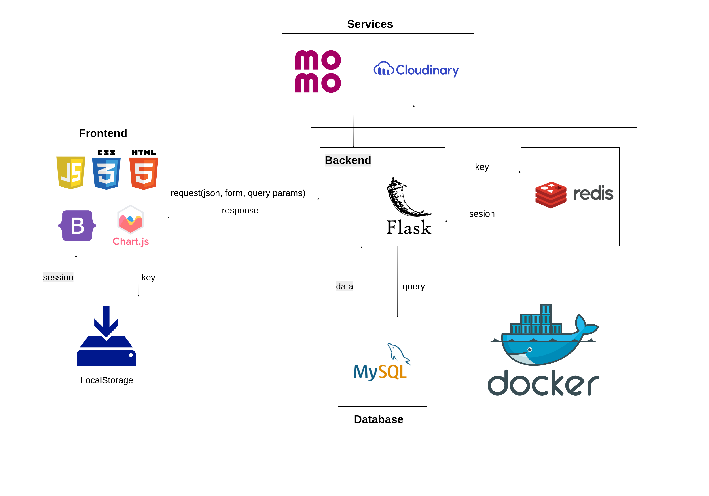

# Quản lý quán coffee

---
<div align="center">
    
    <br>
    <i>System Architecture</i>
</div>

---
## 🛠 Tech Stack

Dự án được xây dựng dựa trên các công nghệ và thư viện hiện đại để đảm bảo hiệu năng và khả năng mở rộng:

### Backend & Database


### Frontend & UI


### DevOps & Tools


### Services


---

## 🛡️ Role-Based Access Control (RBAC)

```text
USER_ROLES
├── Admin
├── Customer
└── Employee
    ├── Manager
    ├── Cashier
    └── Waiter
```
---

## 📐 System Modeling

Hệ thống được phân tích và thiết kế chi tiết bằng công cụ **Astah**. Các tài liệu thiết kế bao gồm:

### 1. Structure Diagram
* **1.1. Use Case Diagram**
* **1.2. Class Diagram**
* **1.3. Object Diagram**
* **1.4. Package Diagram**
* **1.5. Implementation Diagram**
    * 1.5.1. Component Diagram
    * 1.5.2. Deploy Diagram

### 2. Interaction Diagram
* **2.1. Sequence Diagram**
* **2.2. Community Diagram**

### 3. Flowchart
* **3.1. Activity Diagram**
* **3.2. State Diagram**

### 4. Database
* **Entity Relationship Diagram (ERD)**

---

## 📂 Project Structure

```text
my-project/
├── app/
│   ├── controllers/
│   ├── daos/
│   ├── models/
│   ├── static/
│   ├── templates/
│   └── ...
│
├── docker-compose.yml
├── auto_submit_report.py
├── Dockerfile
├── entrypoint.sh
├── requirements.txt
├── run.py
├── initdb.py
├── .env
└── ...
```
[🔗 Link báo cáo](https://docs.google.com/document/d/15nWI9YdeIARDgWQJ-SCU5-yRNv5mMneK1sZlB87JABA/edit?usp=sharing)
 
[🔗 Link web](https://trongtin2005.pythonanywhere.com/)(có thể lúc bạn xem nó đã die do kinh phí ko cho phép:D)

